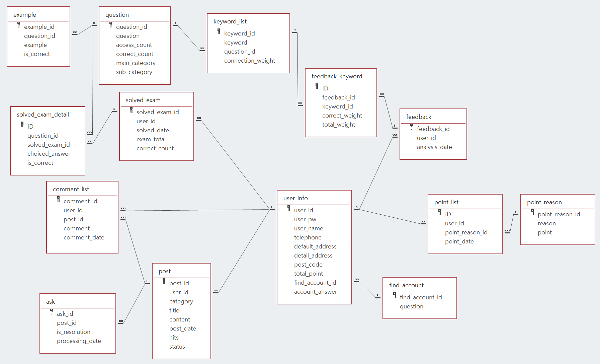

# 프로젝트 소개
OnePass는 AI기반의 문제 풀이 추천 서비스입니다.  
사용자의 문제 풀이 기록을 분석해서 취약한 부분과 그와 관련된 문제를 사용자에게 제공하는 것이 핵심 서비스입니다. 

# 설계 구조

1. 모바일 : 플러터를 사용해서 개발.
    * GitHub 링크 : <https://github.com/Team-Rev/flutter-mobile>
    
2. 웹 : React와 Redux를 사용해서 개발. 
    * GitHub 링크 : <https://github.com/Team-Rev/flutter-mobile>
    
3. 백엔드 : Spring boot를 사용해서 개발. 마이크로 서비스 아키텍처 기반으로 구현
    * EUREKA SERVER : <https://github.com/Team-Rev/MSA-SERVER>
    * API GATEWAY : <https://github.com/Team-Rev/API-GATEWAY>
    * AUTH SERVICE : <https://github.com/Team-Rev/auth-server>
    * PROBLEM SERVICE : <https://github.com/Team-Rev/PROBLEM-SERVICE>
    * BOARD SERVICE : <https://github.com/Team-Rev/board_service>
    * POINT SERVICE : <https://github.com/Team-Rev/point-service>
    * INQUIRY SERVICE : <https://github.com/Team-Rev/inquiry-service>
    
4. 서버 : 클라우드 서버로 AWS와 GCP를 사용. Jenkins를 사용해 자동으로 배포
    * GitHub 링크 : <https://github.com/Team-Rev/CI-CD>
    
5. 데이터베이스 : MS office의 Access를 이용해서 모델링. AWS의 RDS에 MariaDB를 설치하여 사용 
    * 모델링 이미지 

6. 데이터크롤링 : 파이선의 Selenium을 이용해서 데이터 크롤링
    * GitHub 링크 : <https://github.com/Team-Rev/data-crawling>

7. 딥러닝 : 자연어 처리(NLP) 기술을 이용해서 핵심 키워드를 뽑아내도록 작성
    * GitHub 링크 : <https://github.com/Team-Rev/Deep-Learning-NLP>
    
8. 형상관리 : Git과 Github를 이용해서 관리

# MSA SERVER 상세
Eureka Server를 이용해서 Eureka Client들을 관리
